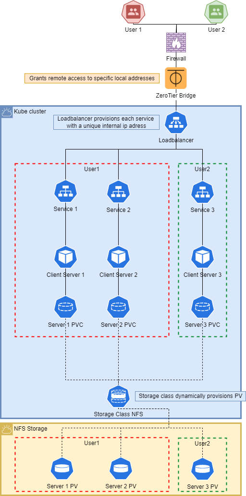
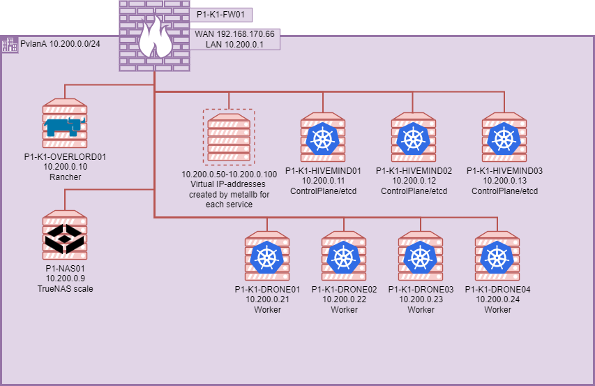

# GameKube
Enterprise grade gameserver deployment on self hosted Kubernetes

# Prerequisites
- Basic knowledge about Kubernetes deployments, services and PV's/PVC's.
- Basic installation of Kubernetes Cluster (using rancher) [tested on a 7 node cluster, 3 control-plane & etcd nodes, 4 worker nodes]. Make sure to not install ingress nginx as we will be using metallb instead.
- Helm installed on a machine with access to the cluster.
- Preconfigured NFS server that can be accessed by the cluster.

# Components
The project consists of multiple components:
- MetalLB loadbalancer for providing access to the services.
- NFS CSI provisioner for dynamically creating PV's on a NFS server when they are needed.
- Deployments for multiple gameservers including factorio and minecraft servers using helm charts.
- Github Actions workflow for automating chart release to folder for usage with Gotohelm.
- Gotohelm custom application for launching helm charts using API calls.



Network design:



# Installation
## NFS CSI provisioner & storage class
Required to dynamically provision each pod with a Persistant Volume. Repo [here](https://github.com/kubernetes-csi/csi-driver-nfs/tree/master).
To install start by adding the repo to helm:

`helm repo add csi-driver-nfs https://raw.githubusercontent.com/kubernetes-csi/csi-driver-nfs/master/charts`

Next install the driver, (important, when using nodes that have both the `control-plane` and the `etcd` taint do ___not___ use `--set controller.runOnControlPlane=true`).

`helm install csi-driver-nfs csi-driver-nfs/csi-driver-nfs --namespace kube-system --version v4.6.0`

Create a storage class, choose to either retain the volume or delete it after it gets released (make sure to edit the `server` and `share` variables to contain the location of your NFS share):

` kubectl create -f .\KubeCore\nfs-csi-driver\nfs-storage-retain.yaml` (retain).

` kubectl create -f .\KubeCore\nfs-csi-driver\nfs-storage.yaml` (delete).

To use the newly configure provisioner add the storage class to the PVC as shown in the example below:

```
apiVersion: v1
kind: PersistentVolumeClaim
metadata:
  name: pvc-factorio
spec:
  accessModes:
    - ReadWriteOnce
  resources:
    requests:
      storage: 1Gi
  storageClassName: nfs-storage
```

## MetalLB loadbalancer
Provisions a unused ip-address for Kubernetes services, allows for a single firewall rule pointing to the service instead of a single Kubernetes node so in case of node faillure the service is still reachable. (Installed using [these instructions](https://docs.k0sproject.io/v1.23.6+k0s.2/examples/metallb-loadbalancer/).) 

To install the loadbalancer:

`kubectl apply -f https://raw.githubusercontent.com/metallb/metallb/v0.10.2/manifests/namespace.yaml`

`kubectl apply -f https://raw.githubusercontent.com/metallb/metallb/v0.10.2/manifests/metallb.yaml`

Next create or edit the ip-address range in the configmap `KubeCore/metallb/metallb-configmap.yaml`, then apply using `kubectl apply -f KubeCore/metallb/metallb-configmap.yaml`. The addresses should be contained in your local subnet and not be in use.

Services can now be create using the `type: LoadBalancer` parameters and will be assigned an ip-address from the specified range.

## Gameserver deployments using helm charts
### Deployments
We start by creating a deployment, this will allow us to configure and run containers/pods on the cluster from a preconfigured file. In this deployment file we have already configure templates like `{{ .Release.Name }}` which will later be used by helm. Example deployment file:

```
apiVersion: apps/v1
kind: Deployment
metadata:
  name: {{ .Release.Name }}
spec:
  replicas: 1
  selector:
    matchLabels:
      app: {{ .Release.Name }}
  template:
    metadata:
      labels:
        app: {{ .Release.Name }}
    spec:
      containers:
        - name: {{ .Release.Name }}
          image: factoriotools/factorio
          ports:
            - containerPort: 34197
              protocol: UDP
          resources:
            limits:
              cpu: {{ .Values.cpu_limit }}
              memory: {{ .Values.memory_limit }}
            requests: 
              cpu: {{ .Values.cpu_requests }}
              memory: {{ .Values.memory_requests }}
          volumeMounts:
            - mountPath: "/factorio"
              name: factorio-volume
      volumes:
        - name: factorio-volume
          persistentVolumeClaim:
            claimName: {{ .Release.Name }}
```
### Persistent volume claims
To keep the servers data persistent even when the pods crashes we configure a volume much like in docker, however in kubernetes this also requires us to create a Persistent Volume Claim (PVC). This can also be configured in a pvc.yaml file:

```
apiVersion: v1
kind: PersistentVolumeClaim
metadata:
  name: {{ .Release.Name }}
spec:
  accessModes:
    - ReadWriteOnce
  resources:
    requests:
      storage: {{ .Values.storage_size }}
  storageClassName: nfs-storage
```
Note that in this PVC we reference the storage class we created earlier. Also note that the `metadata.name` used here should be the same as the name used earlier in the deployment. We just use `{{ .Release.Name }}` and let helm take care of it. This will insure that the name will be the same.

### Services
With the deployment and PVC configured we still need a way to access our containers. This will be done using a service.yaml file:

```
apiVersion: v1
kind: Service
metadata:
  name: {{ .Release.Name }}
spec:
  selector:
    app: {{ .Release.Name }}
  ports:
    - protocol: UDP
      port: 34197
      targetPort: 34197
  type: LoadBalancer
```
Note that we again use `{{ .Release.Name }}` as the `metadata.name` for the same reasons as mentioned earlier. We also choose loadbalancer, this will assign a unique internal ip-address to the services using the metalLB loadbalancer we installed at the start. 

At this point we could manually apply the service, pvc and deployment by
### Helm chart
To move the kubernetes components to a chart start by creating a helm chart directory on a device where helm is installed:

`helm create <name>`

Cd into the created folder, next open values.yaml and delete its contents, also delete the contents of the templates folder.

Now copy the kubernetes service, deployment and pvc manifests into the templates folder.

Using helm the manifests can be deployed using different parameters. By adding key value pairs to the values.yaml file deployment options can be set for each deployment:

```
cpu_limit: 2
cpu_requests: 1
memory_limit: 1Gi
memory_requests: 0.5Gi
storage_size: 1Gi
```

These values can then be reference in the kubernetes manifest files as follows:

```
containers:
  - name: {{ .Release.Name }}
    image: factoriotools/factorio
    ports:
    - containerPort: 34197
      protocol: UDP
    resources:
      limits:
        cpu: {{ .Values.cpu_limit }}
        memory: {{ .Values.memory_limit }}
      requests: 
        cpu: {{ .Values.cpu_requests }}
        memory: {{ .Values.memory_requests }
```
When deploying the helm chart these values will be applied to the manifests, Values starting with `.Values` will be taken from the values.yaml file. `.Release` is a builtin feature in helm, in this case we use this to set the name of the kubernetes resources which will connect them together.

To deploy the chart we can run:

`helm install --generate-name <path-to-helm-folder>`

We use `--generate-name` to make every install unique, allowing us to install the same service multiple times. After running helm install helm should have installed all kubernetes resources on the cluster.

# ToDo

- [ ] Userfriendly portal.
- [ ] Container/pod isolation for cluster.
- [x] Deploy multiple of the same server within a users namespace without manually changing deployments.
- [ ] Configureable options like CPU, memory, and storage for users.
- [ ] Gotohelm API functions for deleting services/players etc.
- [ ] Gotohelm proper error handling in API.
- [ ] Ability for users to add players to their VPN network.
- [ ] Autoinstaller for VPN.
- [ ] Add network bridge/VPN exit node.
- [ ] Different Ip-address pools for metallb (production, test, client servers).
- [ ] Version control on deployable services with the option of choosing server version.
- [ ] Update option for users services.
- [ ] Backup option for user services.
- [ ] Allow console access to gameserver for users.
- [ ] Allow access to server configs for users.
- [ ] Allow access to server save files for users.
- [ ] Make API return required information.
