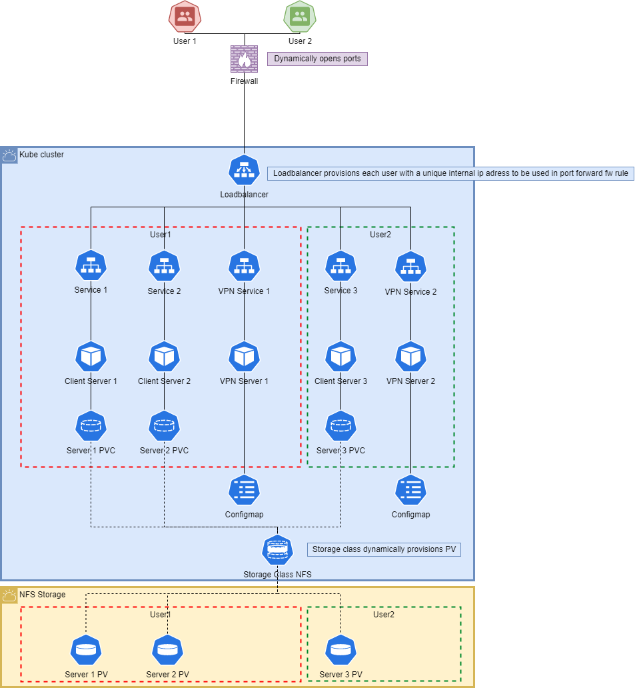

# GameKube
Enterprise grade gameserver deployment on self hosted Kubernetes

# Prerequisites
- Basic knowledge about Kubernetes deployments, services and PV's/PVC's.
- Basic installation of Kubernetes Cluster (using rancher) [tested on a 7 node cluster, 3 control-plane & etcd nodes, 4 worker nodes].
- Helm installed.
- Preconfigured NFS server that can be accessed by the cluster.

# Components
The project consists of multiple components:
- MetalLB loadbalancer for providing access to the services.
- NFS CSI provisioner for dynamically creating PV's on a NFS server when they are needed.
- Deployments for multiple gameservers including factorio and minecraft servers.
- Options for configuring installations using configmaps and secretmaps.

Network design:

# Installation
## NFS CSI provisioner
Required to dynamically provision each pod with a Persistant Volume. Repo [here](https://github.com/kubernetes-csi/csi-driver-nfs/tree/master).
To install start by adding the repo to helm:

`helm repo add csi-driver-nfs https://raw.githubusercontent.com/kubernetes-csi/csi-driver-nfs/master/charts`

Next install the driver, (important, when using nodes that have both the `control-plane` and the `etcd` taint do ___not___ use `--set controller.runOnControlPlane=true`.

`helm install csi-driver-nfs csi-driver-nfs/csi-driver-nfs --namespace kube-system --version v4.6.0`

Create a storage class, choose to either retain the volume or delete it after it gets released (make sure to edit the `server` and `share` variables to contain the location of your NFS share):

` kubectl create -f .\KubeCore\nfs-csi-driver\nfs-storage-retain.yaml` (retain).

` kubectl create -f .\KubeCore\nfs-csi-driver\nfs-storage.yaml` (delete).

# ToDo

- [ ] Userfriendly portal
- [ ] Container/pod isolation
- [ ] Deploy multiple of the same server within a users namespace without manually changing deployments.
- [ ] Configureable options like CPU, memory, and storage for users.
